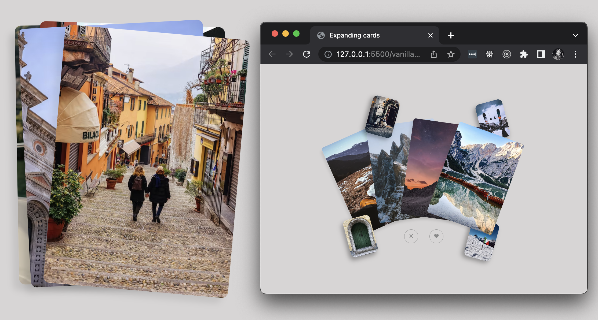

## Card expanding affect

> Here an expanding card collection opens in uniform-arc formation.



Featuring:

- A single vanilla page with collection of x3 card groups.

```css
/* I want to be the best wrapper 📦 :)
To get everything centered ensure your wrapping element has equal measurement to
its children elements, so it covers them with the same size/aspect ratio. We now
keeping everything in proportion to the viewport. Additionally the centering has 
just the parent wrapper called card-groups to position correctly on the page. */
.card-groups,
.card-group,
.card {
  aspect-ratio: 5 / 7;
}
.card-groups,
.card-group,
.big-card {
  width: 30vmin;
}
.card-groups {
  position: relative;
}
.card-group {
  position: absolute;
  transition: transform 400ms ease-in-out;
}
```

- With the `data` attribute, we determine the active group in the collection.

```html
<main>
  <div class="card-groups">
    <div class="card-group" data-index="0" data-status="active"></div>
    <div class="card-group" data-index="1" data-status="unknown"></div>
    <div class="card-group" data-index="2" data-status="unknown"></div>
  </div>
  <div class="card-buttons">
    <button id="hate-button" onclick="hateClick()">
      <i class="fa-solid fa-x"></i>
    </button>
    <button id="love-button" onclick="loveClick()">
      <i class="fa-solid fa-heart"></i>
    </button>
  </div>
</main>
```

- Images are all from [unsplash](https://unsplash.com/) directly.
- Applying animation based on body `data` attribute:

```js
/* We introduce all the interactivity needed here.
Add indexing of our `card-group` and which set is current active "visible"
that is all handled by using `data` attributes in our html. Each separate
group has a data-index='num' attribute and we have a status also. Within
the css we scale unknown card groups to zero 👋, see data selector.

Here we going to change what "card-group" index is active. We iterate our
collective group of cards and need return logic when incrementing, to loop
back to the zero index position, when interaction has reached the end. */
let activeIndex = 0;
const groupList = document.getElementsByClassName("card-group");

// Handler function:
const loveClick = () => {
  // #1 - Increase "bump-up" the active index position:
  // If `activeIndex` is still less than `<=` the maximum length possible,
  // then we increment the value or condition to zero, returning it back.
  let nextIndex = activeIndex + 1 <= groupList.length - 1 ? activeIndex + 1 : 0;

  // Selector:
  // #3 - Here we get the current active & next active group:
  const activeGroup = document.querySelector(`[data-index="${activeIndex}"]`);
  const nextGroup = document.querySelector(`[data-index="${nextIndex}"]`);

  // #3 - Switch activeGroup becomes 'after', css class applies.
  activeGroup.dataset.status = "after";
  // #3 - Switch nextGroup to temp 'becoming-active', css class applies.
  nextGroup.dataset.status = "becoming-active-for-love";
  // #3 - Switch nextGroup to 'active' with delay, css class applies.
  setTimeout(() => {
    nextGroup.dataset.status = "active";
    // #4 - Here we keep the active index position to the next available.
    // We return to index zero if the active position has reached the end.
    // See css selector: `card-group[data-status="status"]` for more detail.
    activeIndex = nextIndex;
  });
};
```

Regards, <br />
Luigi Lupini <br />
<br />
I ❤️ all things (🇮🇹 / 🛵 / ☕️ / 👨‍👩‍👧)<br />
